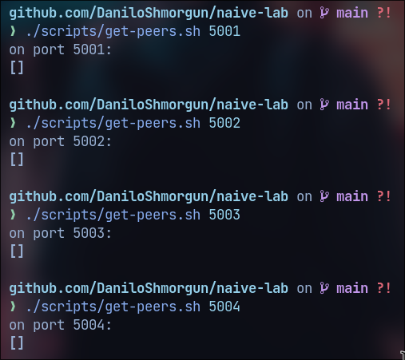

# Blockchain: Laboratory 2. NaiveCoin

*Denis Shmorgun, Danilo Ruban, Ivan Zhytkevych*

---


Метою даного практикуму є отримання навичок роботи з 
блокчейн-платформою на прикладі системи з відкритим кодом NaiveCoin. 
В процесі практикуму ми розгорнемо віртуальну однорангову мережу на базі системи віртуалізації Docker, встановимо та розгорнемо систему NaiveCoin, проведемо транзакції в системі NaiveCoin 
та проведемо аналіз ефективності блокчейну NaiveCoin.

**Постановка задачі:** Завданням практикуму є вивчення структури блоків, транзакцій, гаманця та адреси на прикладі реалізації блокчейну 
з відкритим кодом NaiveCoin, 
а також дослідження механізму консенсусу.

**Хід виконання роботи:**
Під час виконання практикуму були проведені наступні кроки:
- Ознайомлення зі структурою блоків, транзакцій, гаманця та адреси на прикладі NaiveCoin.
- Дослідження механізму консенсусу Proof of Work.
- Встановлення та налаштування середовища для запуску NaiveCoin на власному комп'ютері.
- Запуск чотирьох вузлів мережі NaiveCoin та проведення взаємодії між ними, додавання блоків та відправлення транзакцій.

Під час виконання роботи виникли такі труднощі:
- Проблеми зі створенням власних транзакцій та блоків.
- Потреба у додаткових знаннях з мережевого програмування та роботи з Docker.

Для подолання труднощів було використано наступні шляхи:
- Аналіз коду додатку та дебаггінг програмних помилок;
- Розробка тестових сценаріїв для перевірки роботи різних компонентів системи;

---

# Хід виконання

## Встановлення

У власному репозиторії для лабораторної роботи зклонували репозиторій NaiveCoin

```
git submodule add https://github.com/lhartikk/naivecoin/ naivecoin
```

Створили `Dockerfile` для створення контейнеру
```dockerfile
FROM node:8

WORKDIR /app

COPY naivecoin/package*.json ./

RUN npm install

COPY naivecoin .

EXPOSE 3001

CMD [ "npm", "start" ]
```

та для легкого підняття нод та їх конфігурації відповідний `docker-compose.yml`
```yaml
services:
  node1:
    build: .
    container_name: node1
    ports:
      - 5001:3001

  node2:
    build: .
    container_name: node2
    ports:
      - 5002:3001

  node3:
    build: .
    container_name: node3
    ports:
      - 5003:3001

  node4:
    build: .
    container_name: node4
    ports:
      - 5004:3001
```

Для запуску інфраструктури виконуємо
```bash
docker-compose up
```


## Гаманці

Перевіримо створені гаманці у нод


## Gen Block

Перевіримо перший блок


Цей вихід представляє блок у блокчейні, що містить одну транзакцію. Блок має індекс 0 та відсутній попередній хеш, що вказує на те, що це початковий блок. Він має мітку часу `1465154705` та унікальний хеш `91a73664bc84c0baa1fc75ea6e4aa6d1d20c5df664c724e3159aefc2e1186627`. Важкість і одноразовий номер (nonce) встановлені на 0.

Транзакція всередині блоку має один вхід та один вихід. Вхід має порожній підпис, `txOutId` та `txOutIndex` рівний 0. 

На другій ноді маємо такий же блок


У коді цей блок представлено таким чином:

```typescript
const genesisTransaction = {
    'txIns': [{'signature': '', 'txOutId': '', 'txOutIndex': 0}],
    'txOuts': [{
        'address': '04bfcab8722991ae774db48f934ca79cfb7dd991229153b9f732ba5334aafcd8e7266e47076996b55a14bf9913ee3145ce0cfc1372ada8ada74bd287450313534a',
        'amount': 50
    }],
    'id': 'e655f6a5f26dc9b4cac6e46f52336428287759cf81ef5ff10854f69d68f43fa3'
};

const genesisBlock: Block = new Block(
    0, '91a73664bc84c0baa1fc75ea6e4aa6d1d20c5df664c724e3159aefc2e1186627', '', 1465154705, [genesisTransaction], 0, 0
);
```

Сам блок захардкожений одразу у ланцюг:

```typescript
let blockchain: Block[] = [genesisBlock];
```

## Peers

З самого початку піри не з'єднані




З'єднуємо першу з третьою, та другу з четвертою.


## Mining

Замайнимо блок на 1 пірі


При перевірці балансу бачимо, що на перший пір отримав 50 коінів.


При перегляді бачимо, що після майнингу блоку в нас з'явився новий блок в мережі 1-3 пірів та на адресу першого піра прийшло 50 коінів.


Майнимо на другому пірі


## Transaction

Проведемо транзакції:

1. Переведемо з першої ноди на третю 20 коінів
2. Перевіримо пул першої та третьої ноди
3. Замайнимо блок на першому пірі
4. Перевіримо пул та блоки

Запишемо адресу гаманця третього піру.


Створимо транзакцію переводячи 20 коінів з гаманця першого піра на гаманець другого піра. Фактично надсилаємо дані транзакції (адресу 3 піра та кількість коінів) на перший пір.


Як результати транзакції бачимо для виходи на дві адреси: залишок в 30 коінів переходять на адресу першого піра, а 20 коінів на адресу третього.


Баланси не змінилися


У пулі транзакцій бачимо нашу транзакцію, яка ще не була вписана у блокчейн.


Майнимо блок на першому пірі


Третій пір отримав свої 20 коінів, а перший залишок та 50 коінів за майнинг.


## Connecting two networks

Приєднаємо дві мережі нод, що матимуть різні блоки та транзакції.


Після команди приєднання першої та другої нод маємо такі логи.


Бачимо, що маємо всі однакові блоки на першому та другому пірі.


Поточна ситуація по з'єднаннях виглядає так:


Як результат маємо такі висновки: наш блокчейн, що був на 1 та третій нодах був
замінений блокчейном другої та четвертої нод. При під'єднанні мереж довжина блокчейну двох мереж була однаковою, тому не відбулося у той момент заміни. Після майнингу блока другою нодою перша та третя замінили свої блоки та транзакції, що були раніше, на блоки та транзакції другої та четвертої нод. Таким чином ми провели форк-атаку.

## Blockchain Statistics

Також ми створили скрипт для автоматичного відправлення запитів на ноди для
створення транзакцій та майнингу блоків. Звичайно, в залежності від скрипта
дані можуть бути різними, але при звичайному рівномірному розподілу на майнинг
та проведення транзакцій отримали такі значення.


